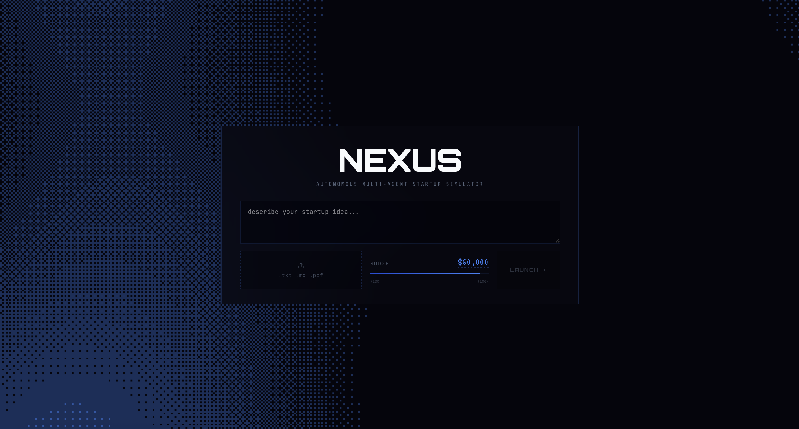

# **NEXUS**

## 📸 **Project Gallery**

   
  <em><strong>Main Page</strong>: Set your startup idea and budget, then launch the simulation</em>

   
  <em><strong>Agent Workspace</strong>: All agents collaborate live across research, debate, and execution</em>

🤖 **Multi-agent startup simulator** with **real-time orchestration**, **debate**, and **CEO control**  
🧠 **RAG-backed reasoning** over an ingested startup knowledge base with **ChromaDB**  
💳 **Stripe-backed execution** for approved spend, plus optional **Gemini + ElevenLabs narration**

## 🚀 **Overview**
**NEXUS** is a full-stack **autonomous startup simulation platform**  
You provide a startup idea and budget, then specialized AI agents run a staged cycle:
**RESEARCH -> PROPOSAL -> DEBATE -> DECISION -> EXECUTION**

The backend orchestrates phase transitions, event streaming, proposal handling, and budget mutations  
The frontend visualizes live agent behavior, proposal escalation, CEO decisions, and budget impact in one interface  
The platform also includes ingestion tooling for building and maintaining a startup-focused **RAG corpus** from web and local sources

## 💡 **Core Features**

### 🧩 **Multi-Agent Simulation Engine**
- Five role-specific agents: **Market**, **Product**, **Tech**, **Finance**, **Risk**
- Structured phase lifecycle with explicit state transitions
- Parallel phase execution for faster simulation loops
- Debate rounds with vote extraction, consensus checks, and escalation logic

### 🧠 **RAG + Knowledge Operations**
- **ChromaDB** retrieval with domain, topic, and freshness filtering
- Configurable embedding provider support: **Gemini** or **OpenAI**
- Ingestion pipeline for crawl, clean, chunk, embed, and index
- Endpoints for direct ingest and search debugging

### 👔 **CEO Decision Workflow**
- Real-time proposal escalation through **WebSocket**
- Clear binary control: **APPROVE** or **REJECT**, with optional note
- Budget tracking and transaction recording per executed proposal
- Stripe payment path for approved spend operations

### 📡 **Real-Time UX + Narration**
- Live simulation stream over **WebSocket**
- Activity feed, stage progression, budget telemetry, and transaction events
- Optional narrator pipeline: event filtering, narration generation, audio synthesis, client playback
- Simulation stop flow with clean lifecycle handling

### 📊 **Session APIs + Reporting**
- Start, list, and inspect simulation sessions
- Event streaming via **SSE**
- Decision endpoint for paused decision phases
- Generated session report with rounds, decisions, key events, and final budget summary

### 🔐 **Payments & Integrations**
- Stripe webhook endpoint with signature validation and tolerance checks
- ElevenLabs voice synthesis endpoints (base64 and raw audio variants)
- Environment-driven provider and model configuration

## 🏗️ **Architecture**
**Frontend** (**chorus**, **React**, **Vite**)  
-> connects to backend via **WebSocket** and **REST**  
-> renders agent state, approvals, activity, budget, and narration audio

**Backend** (**FastAPI**)  
-> **SimulationOrchestrator** controls phases and proposal lifecycle  
-> **DebateManager** coordinates multi-round debate logic  
-> **EventBus** publishes events to WebSocket and SSE consumers  
-> **Retriever + ChromaDB** provide RAG context  
-> Integrations: **Stripe**, **ElevenLabs**, **Gemini**

**Data Layer**  
-> **ChromaDB** for vector retrieval  
-> **PostgreSQL** for ingestion runs, sources, pages, chunks, and errors

## 🛠️ **Tech Stack**

| Layer | Technologies |
| --- | --- |
| **Backend** | **Python**, **FastAPI**, **Pydantic** |
| **Frontend** | **React**, **TypeScript**, **Vite**, **Tailwind CSS**, **Framer Motion** |
| **AI/LLM** | **Anthropic**, **Google Gemini** |
| **RAG** | **ChromaDB**, **OpenAI Embeddings**, **Gemini Embeddings** |
| **Data** | **PostgreSQL**, **psycopg** |
| **Integrations** | **Stripe**, **ElevenLabs** |
| **Testing** | **Pytest** |
| **Additional Language Footprint** | **Ruby**, **Ruby on Rails** |

## 🌟 **What Sets It Apart**
- **End-to-end startup simulation loop** from market analysis to execution with explicit decision checkpoints
- **Real-time explainable behavior** across stages, debate events, proposal lifecycle, and budget telemetry
- **Integrated operating stack** combining RAG ingestion, payment execution, webhooks, and narration
- **Extensible architecture** for adding new agents, phases, domains, and integrations without core rewrites
