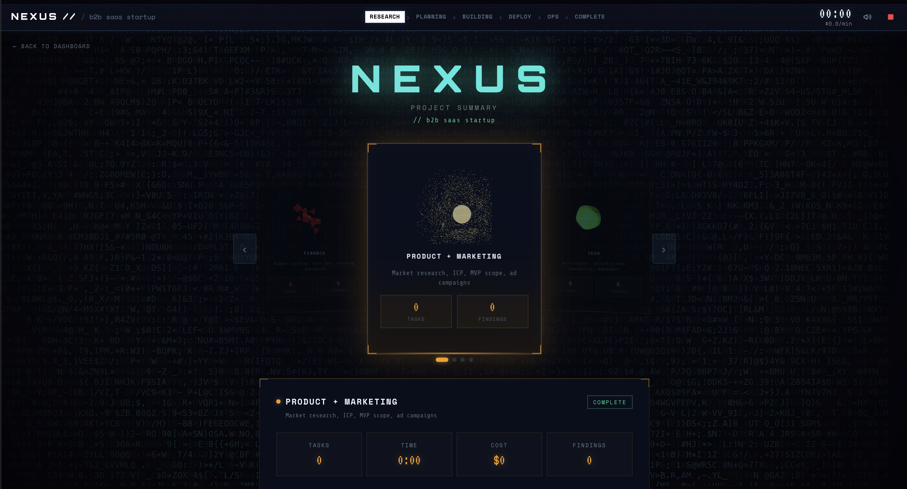

# **NEXUS**

## 💼 **Challenge Contributions**

### Best Built on Rails Project
Ruby on Rails is the operational backbone of NEXUS. It orchestrates multi-agent workflows, proposal lifecycles, budget governance, and real-time event delivery to the frontend. This gives us a production-grade control plane where complex autonomous behavior remains reliable, observable, and scalable.

### Best Autonomous Consulting Agent
NEXUS behaves like a full executive team operating at startup speed. Our agents independently analyze markets, pressure-test strategy, allocate capital, and execute decisions end-to-end, delivering autonomous consulting that feels like a live boardroom in motion.

### Best Adaptable Agent
Our agents are built for volatility. As budgets shift, outcomes change, or new data appears, they re-prioritize instantly, revise plans intelligently, and keep execution aligned with the highest-leverage next move.

### Best Team Under 22
Every builder behind NEXUS is under 22, and we engineered this platform with the rigor of an experienced founding team. We combined speed, ambition, and technical depth to build a fully autonomous multi-agent startup simulator that pushes beyond demo-level AI into real operational intelligence.

### Best Use of Gemini
Gemini unlocks multimodal intelligence for NEXUS agents by combining text, images, and documents into a single decision context. This allows the system to synthesize richer evidence and produce sharper, more grounded strategic recommendations.

### Best Use of Claude
Claude powers deep strategic reasoning across research, product, finance, and risk. It enables agents to challenge assumptions, debate trade-offs, and converge on high-quality decisions under uncertainty, all grounded in our curated startup knowledge base.

### Best Stripe Integration
Stripe makes agent decisions economically real. Once proposals are approved, spend is executed in sandbox with complete traceability, so every financial action is explicit, auditable, and reviewable. That turns AI planning into accountable execution.

### Best Use of ElevenLabs
ElevenLabs gives each agent a distinct, natural voice that narrates debates, proposals, and decisions in real time. The result is a simulation that is not only technically deep, but also immersive, legible, and compelling for judges and users.

### Best Use of Data
We built a high-signal startup intelligence layer from proven frameworks (including OpenView playbooks) across pricing, retention, growth, product, fundraising, and operations. NEXUS agents do not guess, they reason on structured evidence, translate it into concrete plans, and continuously refine decisions as new signals arrive.

## 📸 **Project Gallery**

   
  <em><strong>Main Page</strong>: Set your startup idea and budget, then launch the simulation</em>

   
  <em><strong>Agent Workspace</strong>: All agents collaborate live across research, debate, and execution</em>

   
  <em><strong>Project Summary</strong>: Project summary view</em>

🤖 **Multi-agent startup simulator** with **real-time orchestration**, **debate**, and **CEO control**  
🧠 **RAG-backed reasoning** over an ingested startup knowledge base with **ChromaDB**  
💳 **Stripe-backed execution** for approved spend, plus optional **Gemini + ElevenLabs narration**

## 🚀 **Overview**
**NEXUS** is a full-stack **autonomous startup simulation platform**  
You provide a startup idea and budget, then specialized AI agents run a staged cycle:
**RESEARCH -> PROPOSAL -> DEBATE -> DECISION -> EXECUTION**

The backend orchestrates phase transitions, event streaming, proposal handling, and budget mutations  
The frontend visualizes live agent behavior, proposal escalation, CEO decisions, and budget impact in one interface  
The platform also includes ingestion tooling for building and maintaining a startup-focused **RAG corpus** from web and local sources

## 💡 **Core Features**

### 🧩 **Multi-Agent Simulation Engine**
- Five role-specific agents: **Market**, **Product**, **Tech**, **Finance**, **Risk**
- Structured phase lifecycle with explicit state transitions
- Parallel phase execution for faster simulation loops
- Debate rounds with vote extraction, consensus checks, and escalation logic

### 🧠 **RAG + Knowledge Operations**
- **ChromaDB** retrieval with domain, topic, and freshness filtering
- Configurable embedding provider support: **Gemini** or **OpenAI**
- Ingestion pipeline for crawl, clean, chunk, embed, and index
- Endpoints for direct ingest and search debugging

### 👔 **CEO Decision Workflow**
- Real-time proposal escalation through **WebSocket**
- Clear binary control: **APPROVE** or **REJECT**, with optional note
- Budget tracking and transaction recording per executed proposal
- Stripe payment path for approved spend operations

### 📡 **Real-Time UX + Narration**
- Live simulation stream over **WebSocket**
- Activity feed, stage progression, budget telemetry, and transaction events
- Optional narrator pipeline: event filtering, narration generation, audio synthesis, client playback
- Simulation stop flow with clean lifecycle handling

### 📊 **Session APIs + Reporting**
- Start, list, and inspect simulation sessions
- Event streaming via **SSE**
- Decision endpoint for paused decision phases
- Generated session report with rounds, decisions, key events, and final budget summary

### 🔐 **Payments & Integrations**
- Stripe webhook endpoint with signature validation and tolerance checks
- ElevenLabs voice synthesis endpoints (base64 and raw audio variants)
- Environment-driven provider and model configuration

## 🏗️ **Architecture**
**Frontend** (**chorus**, **React**, **Vite**)  
-> connects to backend via **WebSocket** and **REST**  
-> renders agent state, approvals, activity, budget, and narration audio

**Backend** (**FastAPI**)  
-> **SimulationOrchestrator** controls phases and proposal lifecycle  
-> **DebateManager** coordinates multi-round debate logic  
-> **EventBus** publishes events to WebSocket and SSE consumers  
-> **Retriever + ChromaDB** provide RAG context  
-> Integrations: **Stripe**, **ElevenLabs**, **Gemini**

**Data Layer**  
-> **ChromaDB** for vector retrieval  
-> **PostgreSQL** for ingestion runs, sources, pages, chunks, and errors

## 🛠️ **Tech Stack**

| Layer | Technologies |
| --- | --- |
| **Backend** | **Python**, **FastAPI**, **Pydantic** |
| **Frontend** | **React**, **TypeScript**, **Vite**, **Tailwind CSS**, **Framer Motion** |
| **AI/LLM** | **Anthropic**, **Google Gemini** |
| **RAG** | **ChromaDB**, **OpenAI Embeddings**, **Gemini Embeddings** |
| **Data** | **PostgreSQL**, **psycopg** |
| **Integrations** | **Stripe**, **ElevenLabs** |
| **Testing** | **Pytest** |
| **Additional Language Footprint** | **Ruby**, **Ruby on Rails** |

## 🌟 **What Sets It Apart**
- **End-to-end startup simulation loop** from market analysis to execution with explicit decision checkpoints
- **Real-time explainable behavior** across stages, debate events, proposal lifecycle, and budget telemetry
- **Integrated operating stack** combining RAG ingestion, payment execution, webhooks, and narration
- **Extensible architecture** for adding new agents, phases, domains, and integrations without core rewrites
